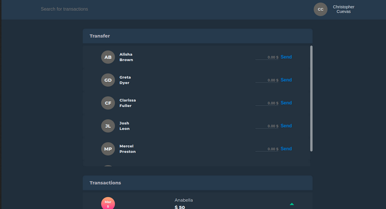

# Bank System

This project was built utilizing the PERN-Stack and other technologies.

## Main Technologies List

- Front-end: React.js
- Back-end: Node.js, Express.js.
- User Authentication: Google APIs, Passport.js, Passport-jwt, jsonwebtoken.
- Mail service: Nodemailer.js.

## Screenshots

## Features

- JWT user authentication.
- Google strategy user authentication.
- User mail verification.
- Send and receive credit.
- Mail notification with information about the transaction for user who sends the credit and who receives it.
- Automatically update transactions components after sending credit.
- Search information about transactions such as specific date, who sent or who the credit was sent to and if the credit increment or decrement.
- Immediately see what's your current credit after a successful transaction.

### `Live`

Link: [Bank System App](https://bank-system-app.vercel.app)
